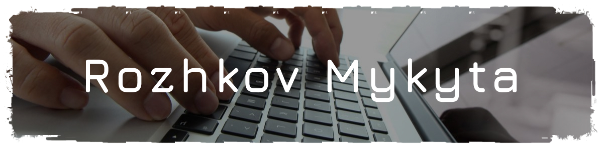
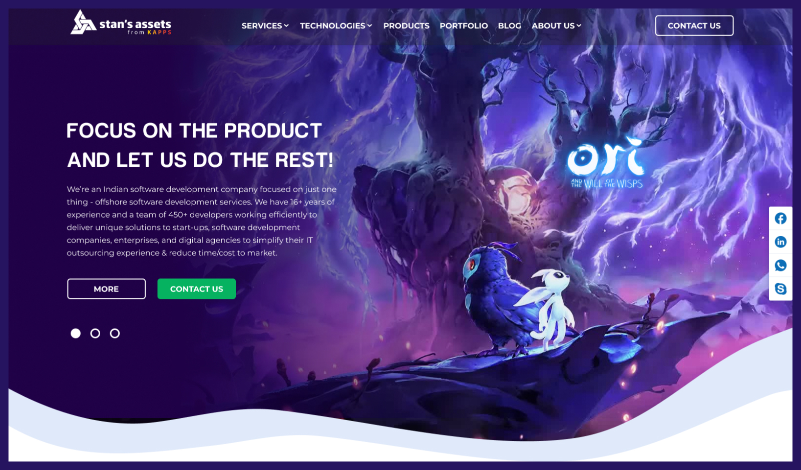
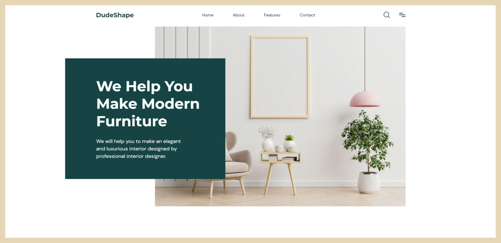

## Front-end розробник, з доствідом роботи понад рік.

### МоЇ роботи:
#### Stan's Assets

#### Sea Food

#### Dude Shape

### Технології: 

Верстальник сайтів. Маю знання Html5, Css3, Js, Scss, BEM. Маю навички SEO, alt, meta tags. Надійність, адаптивність, кросбраузерність та оптимізація.

### Мої контакти:
